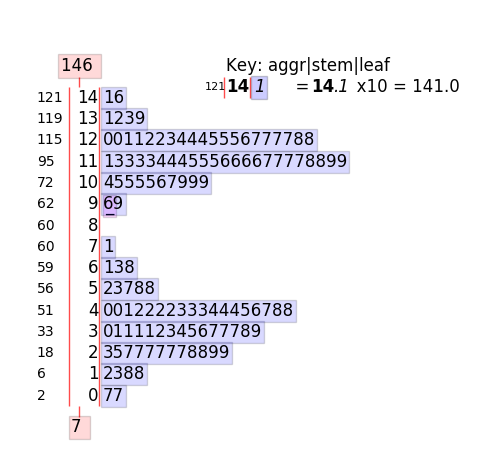

Introduction
============

John Tukey’s stem-and-leaf plot first appeared in 1970. Although very useful back then,
it cannot handle more than 300 data points and is completely text-based. Stemgraphic is
a very easy to use python package providing a solution to these limitations.

A typical stem_graphic output:

For an in depth look at the algorithms and the design of stemgraphic, see

https://github.com/fdion/stemgraphic/raw/master/doc/stemgraphic%20A%20Stem-and-Leaf%20Plot%20for%20the%20Age%20of%20Big%20Data.pdf

A PDF version of the documentation is available at: http://stemgraphic.org/doc/stemgraphic.pdf

The official website of stemgraphic is: http://stemgraphic.org

Installation
============

Stemgraphic requires docopt, matplotlib, pandas and seaborn. Optionally, having Scipy installed will give
you secondary plots, cufflinks for interactive plots and Dask (see requirements_dev.txt for all needed to
run all the functional tests) will allow for out of core, big data visualization.

If you use conda, it is recommended you conda install docopt, matplotlib, pandas, seaborn, and scipy
before doing a pip install of stemgraphic.

Installation of stemgraphic is simple:

pip3 install -U stemgraphic

or from a clone of the github repository, in the package root:

python3 setup.py install
